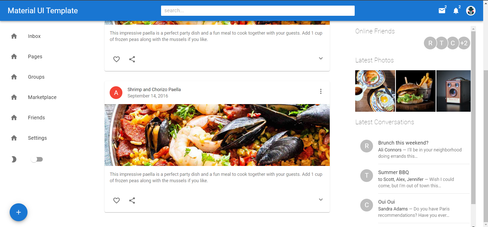

# Weather App

## Table of Contents
  <br />

* [About the Project](#about-the-project)
* [Built With](#built-with)
* [Contributing](#contributing)
* [Contact](#authors)
* [Acknowledgements](#acknowledgements) 
* [Getting Started](#getting-started) 
* [Live Demo and Video](#live-version) 

#
<br />

 <br/>
 <br/>
 <br/>


<br />

### Built With

* [REACT] [MATERIALUI5] [WEBPACK] [BABEL] [API]

## Live Version

* [Live Demo](https://material5-design.vercel.app/) 

<!-- ABOUT THE PROJECT   -->
## About The Project
This MaterialUI5 template can be used by anyone who wishes to start working on a personal blog. It is build with React 18 and Material UI 5. As well is it a mobile first template using PWA. Hence it can be installed on a mobile device.

## Screenshot Test

<p align="center">
  
</p>


## Contributing

Contributions make the open-source community such an amazing place to learn, inspire, and create. Any contributions you make are **greatly appreciated**.

## Prerequisites

Terminal or similar to execute the program.


## Getting Started


## Clone project

- To get a local copy up and running follow these simple example steps.
- Clone this repository with git clone ```https://github.com/sergiocortessat/scs-weather-app``` using your terminal or command line.
- Change to the project directory by entering: ```cd scs-weather-app``` in the terminal.
- Enter the project folder and set the repo with its correspondent using npm install.
- After this run the command npx run start
- If the project cant be build, please run npx webpack.

## Command line steps
```
- $ git clone `$ git clone https://github.com/sergiocortessat/scs-weather-app
- $ git checkout develop
- $ cd scs-weather-app
- $npm i
- $ npm start
- ##(If project doesn't build, please run): $ npx webpack
```

## Authors

👤 Sergio Cortes Satizabal

- Github: [@sergiocortessat](https://github.com/sergiocortessat)
- Twitter: [@sergiocortessat](https://twitter.com/sergiocortessat)
- LinkedIn: [@sergiocortessat](https://www.linkedin.com/in/sergio-cortes-satizabal-3b452194/)


<!-- ACKNOWLEDGEMENTS -->
## Acknowledgements


## 📝 License

This project is [MIT](https://github.com/sergiocortessat/sergiocortessat/blob/main/LICENSE) licensed.


